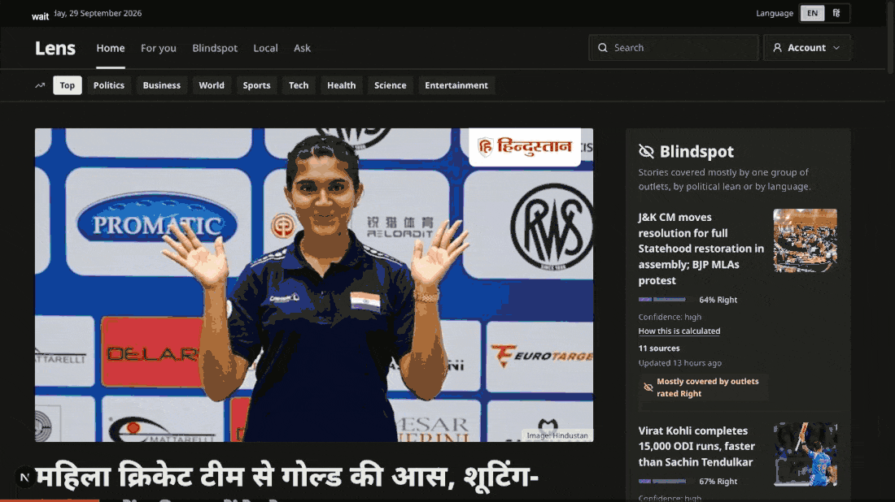
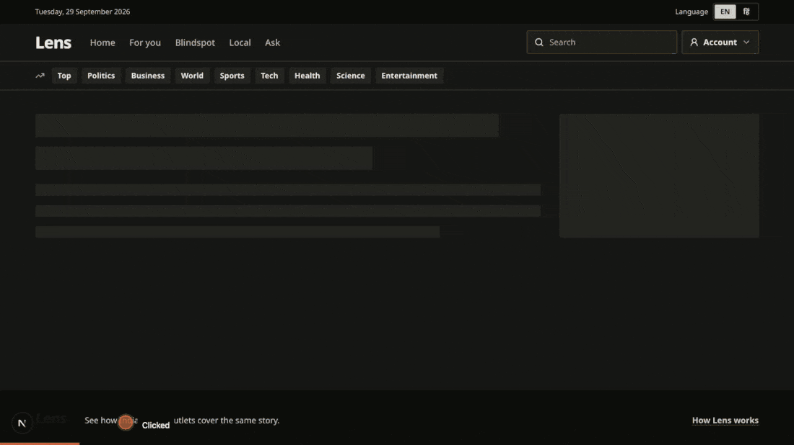
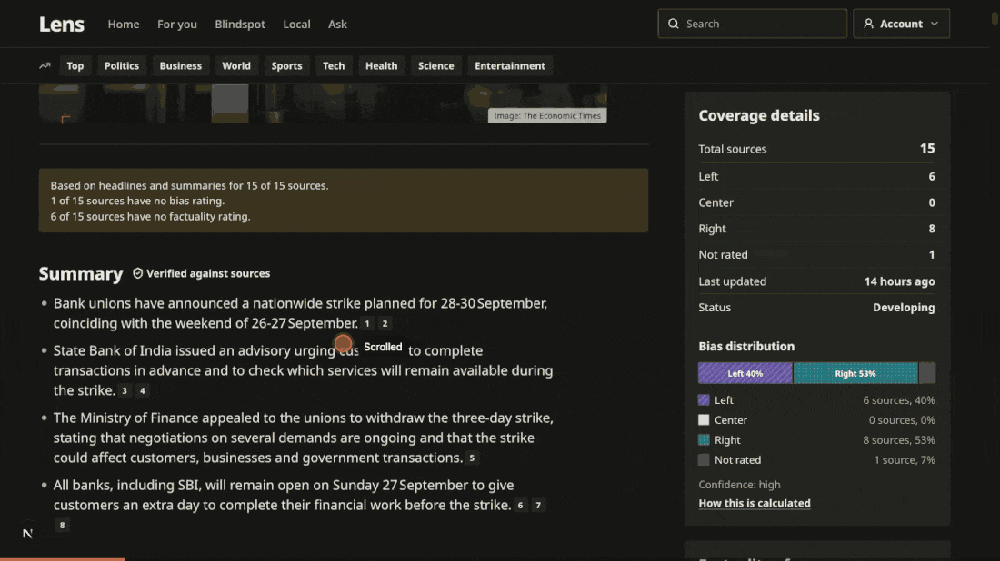
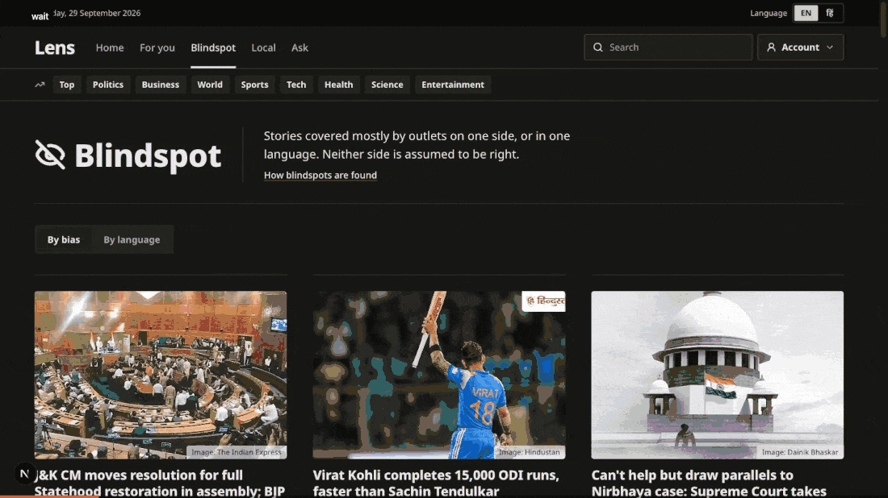
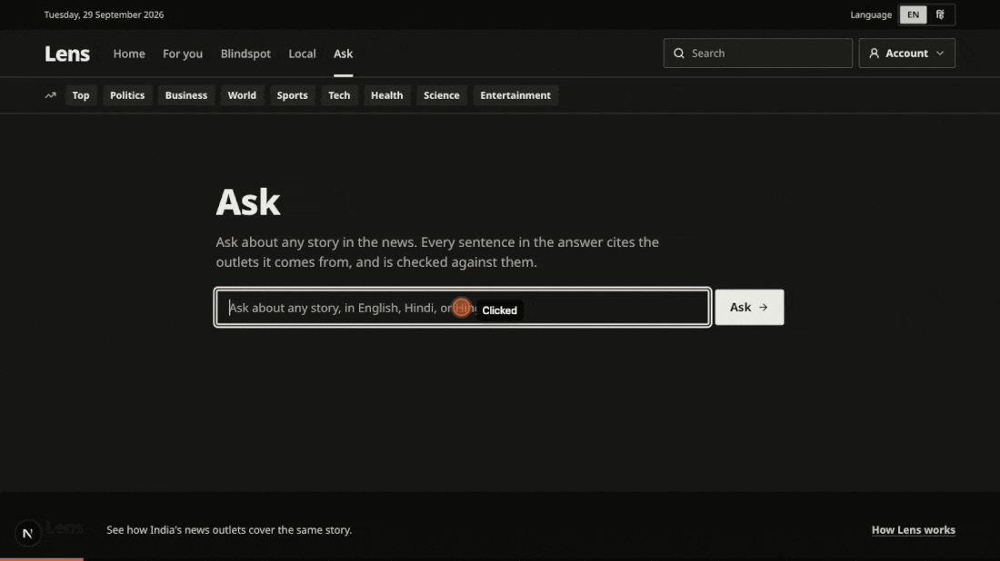
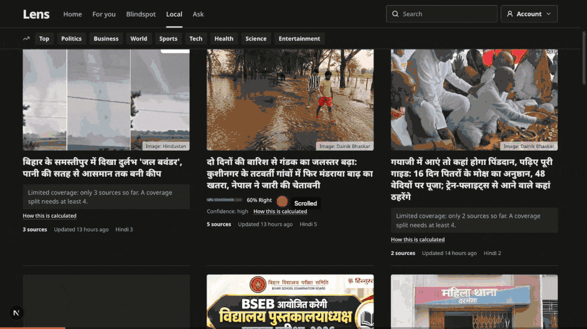
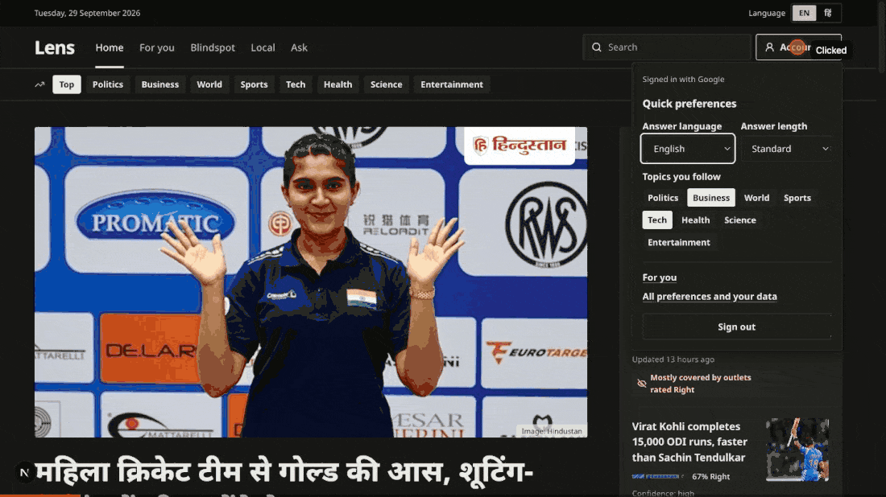

# Lens

**See how India's news outlets cover the same story.**

Lens groups coverage of one story from many outlets, in English, Hindi and Marathi, and shows who covered it and how each side framed it. It links claims to fact-checks and answers questions in plain language, with a source on every sentence. Lens is a working name.

The GIFs below are recorded from the running app on real data (17 outlets, about 98,000 articles).

---

## What it does

### A front page of compared stories

Each story carries a coverage bar. It shows how many of its sources lean Left, Center or Right (outlet ratings from Media Bias/Fact Check), with a confidence level and a link to how it's calculated. Topic tabs filter the feed.



### Every story: coverage details and every source

A story page lists every outlet that covered it: language, bias rating, factuality, owner, and a link to the original. Filters narrow the list by lean or language. The panel on the right breaks the coverage down.



### A verified summary, where outlets agree, and how they differ

The AI summary is built only from the articles. Every sentence cites its sources (click a number to see the headline and a link). A separate judge model checks each sentence against its sources before anything is published. "How headlines frame it" compares the angles taken by different outlets and languages.



### Blindspots

Stories covered mostly by one side, or mostly in one language (for example, big in Hindi papers, barely in English ones). Neither side is assumed to be right.



### Ask

Ask about any story in English, Hindi or Hinglish. The answer is written only from retrieved coverage, balanced across outlets. Every sentence is cited and checked against its sources, and anything that fails is removed and listed under "Limitations". With too little reliable coverage, Lens says so instead of guessing. Prompt injection, loaded questions, false premises and personal data are guarded against. On a 130-case test set it passes 100% of adversarial cases, with no false refusals.



### Local news

The Local tab asks for your location and works out your state **on your device**, so only the state name is sent. You can also pick a state from the list. Stories are placed in a state from the local sections of outlets' URLs.



### Sign in, preferences, and Hindi

Sign in with Google to save preferences (answer language, answer length, topics you follow) and get a For you page. Lens asks Google only for an anonymous account ID. It never receives your email or name, and stores only a hash of the ID. The whole site also runs in Hindi.



---

## How it works

```
 RSS / sitemaps ──► ingest worker ──► Postgres (articles, stories, ratings)
                                  └─► pipeline worker, every 15 min:
                                        embed (BGE-M3) ──► Qdrant
                                        cluster into stories (cross-lingual)
                                        topics, regions, coverage stats, blindspots
                                        fact-check matching (Google Fact Check Tools)
                                        LLM story analysis: claims ─► framing ─► cited summary ─► judge
 Browser ──► Next.js ──► FastAPI ──► Ask graph (LangGraph):
                                        understand ─► guard ─► hybrid retrieval ─► balance outlets
                                        ─► synthesize with citations ─► verify quotes and claims ─► translate
```

**Principles, enforced in code** (full list in [`CLAUDE.md`](CLAUDE.md)):

- **Every generated sentence is cited.** The schema requires at least one article per sentence. Quotes are checked word for word against the stored text before any model-based check.
- **Article text and user input are data, never instructions.** They are wrapped in delimiters, and the models that write summaries and answers have no tools.
- **Abstain rather than guess.** Weak retrieval gets "not enough reliable coverage".
- **No political profiling.** Lens never infers or stores a reader's leaning. Personalization never changes which outlets appear in a story or an answer, and a test checks this.
- **Ratings need provenance.** Every outlet rating or ownership fact carries its rater, method, evidence link, date and confidence. Unknown values show as "Not rated".
- **Evals gate changes.** CI fails when a prompt, model config or dataset changes without a fresh eval report that passes its thresholds.

## Evaluation (current release)

| Suite | Result | Gate |
|---|---|---|
| Ask: adversarial pass rate | 1.000 | ≥ 0.95 |
| Ask: benign false-block rate | 0.000 | ≤ 0.03 |
| Ask: citation presence | 1.000 | = 1.00 |
| Ask: p95 latency | 13.6 s | ≤ 15 s |
| Retrieval recall@10 | 0.971 | no drop vs. baseline |
| Clustering B³ F1 | 0.967 | no drop vs. baseline |
| Fact-check "same claim" precision | 0.902 | ≥ 0.90 |

Reports are in [`reports/`](reports/). Methods are in [`docs/08_EVALS_LLMOPS.md`](docs/08_EVALS_LLMOPS.md).

## Stack

- **Backend:** Python 3.12, FastAPI, Pydantic v2, SQLAlchemy 2 + Alembic, LangGraph, LangSmith, Arq + Redis, Qdrant, BGE-M3 (FlagEmbedding), HDBSCAN
- **Frontend:** Next.js 16 (App Router), TypeScript, Tailwind, next-intl (English and Hindi), MSW fixtures, Playwright, Vitest
- **Models:** free tiers only. Groq (gpt-oss, Qwen) with Gemini as the fallback; tiers are set in [`config/models.yaml`](config/models.yaml).
- **Infra:** Docker Compose (Postgres 16, Qdrant, Redis, ingest and pipeline workers)

## Run it locally

```bash
cp infra/.env.example .env        # fill in keys; never commit .env
make install                      # backend (uv) and frontend (npm)
make up && make migrate && make seed
make ingest-up && make pipeline-up   # workers: fetch feeds, then embed, cluster and analyze every 15 min
make backend-dev                  # API on http://localhost:8000
make frontend-dev                 # web on http://localhost:3000
```

Just the UI, on fictional fixtures: `make frontend-mock`.

**Keys** (all free tiers): `GROQ_API_KEY`, `GEMINI_API_KEY`, `GOOGLE_FACTCHECK_API_KEY`, `LANGSMITH_API_KEY`.

For Google sign-in, set `GOOGLE_CLIENT_ID` and `GOOGLE_CLIENT_SECRET` from a Google Cloud OAuth client of type "Web application". Its redirect URI must be `http://localhost:8000/api/v1/auth/google/callback`.

**Everyday commands:**

| Command | What it does |
|---|---|
| `make test` / `make lint` | Backend and frontend tests; ruff, mypy, eslint, tsc |
| `make eval` / `make eval-gate` | Run the eval suites / check them against the gates |
| `make release NAME=…` / `make rollback TO=…` | Pin prompts, models and retrieval config together / go back to a release |
| `make ingest-health` | Lag and failures for each outlet |
| `make pipeline-logs` | Watch the pipeline worker |

## Repository

```
backend/    FastAPI app, workers, LangGraph graphs, guardrails, evals   (src/lens/…)
frontend/   Next.js app, components, i18n messages, MSW mocks, tests
config/     models, retrieval, clustering, guardrails, memory, regions, auth, eval gates
data/       sources (with evidence), eval datasets
docs/       product, architecture, data model, pipeline, retrieval, agents, guardrails,
            evals, API, UI, memory, build plan, India sources, STATUS, DECISIONS (ADRs)
reports/    eval and review reports
infra/      docker compose, .env.example
```

Start with [`docs/STATUS.md`](docs/STATUS.md) for what is running now and [`docs/DECISIONS.md`](docs/DECISIONS.md) for why things are the way they are.

## Data and licensing

Lens stores headlines and short feed summaries (`snippet_only`) by default and links to the original article. Outlet images are shown with credit. Bias and factuality ratings come from Media Bias/Fact Check and are attributed, with confidence and a methodology link. Some Indian-language papers are rated by Lens editors; those ratings are labeled with low confidence. Fact-checks come from IFCN fact-checkers through Google's Fact Check Tools API.

The fixtures in `frontend/src/mocks/` are fictional. State boundaries on the Local tab come from [DataMeet India](https://github.com/datameet/maps) (CC BY 4.0).
