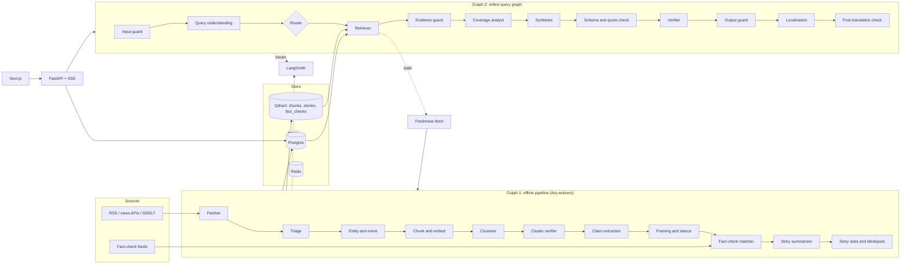

# 02 Architecture

## System overview

Two LangGraph graphs share one knowledge store.

- **Graph 1, offline pipeline:** runs on a schedule. Fetch, triage, chunk, embed, cluster, analyze, summarize. Builds the story index.
- **Graph 2, online query graph:** runs per user question. Understand, retrieve, analyze coverage, synthesize with citations, verify, guard, localize.

Not everything is an "agent". Fetching, clustering, coverage math, and quote verification are deterministic code.



## Components

| Component | Responsibility |
|---|---|
| **FastAPI** | REST and SSE endpoints (`docs/09`). Thin routers, services, repositories |
| **Arq + Redis** | Job queue for the offline pipeline and on-demand freshness fetches |
| **Postgres** | Articles, stories, claims, framings, source metadata, summaries, users, logs, LangGraph checkpoints |
| **Qdrant** | Vector indexes: `chunks` (dense + sparse + ColBERT multivector), `stories` (centroids), `fact_checks` |
| **LangGraph** | Both graphs. Postgres checkpointer for the online graph |
| **LangSmith** | Traces, guard results as feedback, datasets, experiments, online evals, annotation queues |
| **Next.js** | Web UI, server-rendered story pages, ISR caching |

## Model tiers (`config/models.yaml`)

Every LLM or model call names a **tier**, not a model. Tiers map to providers and model IDs in config.

| Tier | Used by | Requirement |
|---|---|---|
| `embedding` | chunking, clustering, retrieval | BGE-M3 (dense + sparse + multivector). Benchmark against multilingual-e5 and LaBSE |
| `reranker` | ColBERT rerank | BGE-M3 multivector or Jina-ColBERT-v2. Optional cross-encoder for comparison |
| `triage` | language ID, is-news, entity extraction | Small, cheap. Classifiers where possible |
| `query_understanding` | Graph 2 | Small, handles Hindi and Hinglish |
| `analysis` | claims, framing, stance, cluster verifier | Mid-size, structured output reliable in Indic languages |
| `synthesis` | answers and story summaries | Strong model |
| `judge` | verifier and evals | **Different model family than `synthesis`** to reduce self-preference bias |
| `translation` | localization | IndicTrans2, Bhashini, or Sarvam. Benchmark per language |
| `tts` | audio (P2) | Sarvam or Bhashini |

`config/models.yaml` starter (fill IDs after benchmarking, do not guess):

```yaml
tiers:
  triage:            { provider: TBD, model: TBD, max_tokens: 512,  temperature: 0 }
  query_understanding: { provider: TBD, model: TBD, max_tokens: 512, temperature: 0 }
  analysis:          { provider: TBD, model: TBD, max_tokens: 2048, temperature: 0 }
  synthesis:         { provider: TBD, model: TBD, max_tokens: 2048, temperature: 0.2 }
  judge:             { provider: TBD, model: TBD, max_tokens: 1024, temperature: 0 }
fallbacks:
  synthesis: [analysis]     # used by the circuit breaker
```

## Latency and cost targets (starting values)

| Path | Target |
|---|---|
| Feed and story pages | Served from cache and precomputed data. p95 under 500 ms server time |
| Ask, first status event | Under 1 s |
| Ask, first answer token | Under 4 s |
| Ask, complete answer | p95 under 15 s |
| Ask cost | Track per query in LangSmith. Set a budget after Phase 6 baseline |

Precompute what you can: story summaries, framing, stance, fact-check matches. At query time the expensive work is one retrieval pass and one synthesis call plus the verifier.

## Caching

- Feed: Redis, 30 to 60 s TTL
- Story detail: Next.js ISR, revalidate on story update event
- Ask: no answer caching in MVP (freshness and citations matter more). Cache retrieval results per neutral query for 2 minutes only

## Configuration and environment

`infra/.env.example` must include (no real values):

```
DATABASE_URL=
REDIS_URL=
QDRANT_URL=
QDRANT_API_KEY=
LANGSMITH_TRACING=true
LANGSMITH_API_KEY=
LANGSMITH_PROJECT=lens-dev
LLM_PROVIDER_KEYS=            # per provider, see config/models.yaml
NEWS_API_KEYS=                # NewsData.io, GNews, etc.
GOOGLE_FACTCHECK_API_KEY=
BHASHINI_KEYS=
SARVAM_API_KEY=
APP_ENV=dev
```

## Security

- Rate limits per IP and per user on `/ask` and `/search`
- Hard token and tool-call budgets per Ask
- CORS restricted to the web origin
- No secrets in the repo. Vault or platform secret store in deployment
- PII masking before traces and logs (`G-OUT-05`)
- Admin routes behind separate auth (`docs/09`)

## Observability

- One LangSmith trace per Ask and per offline pipeline run per story
- Every guard is a named run with a verdict, reason, and feedback score
- Tags on every trace: `lang`, `intent`, `topic`, `graph`, `prompt_version`, `model_tier_versions`
- Structured JSON logs with request IDs, PII-masked
- Metrics: latency p50 and p95, tokens, cost, abstain rate, guard block rate, queue lag, ingest lag per source

## Failure behavior

| Failure | Behavior |
|---|---|
| LLM provider error or timeout | Circuit breaker, fall back to precomputed story summary or a lower tier. Never return a raw error for Ask if a precomputed summary exists |
| Qdrant down | Story pages still served from Postgres. Ask returns a clear unavailable state |
| Freshness fetch slow | Proceed with stale data, set `stale=true`, tell the user the newest article time |
| Guard blocks | Return the abstain or refusal state from `docs/10`, log a `guard_events` row |
